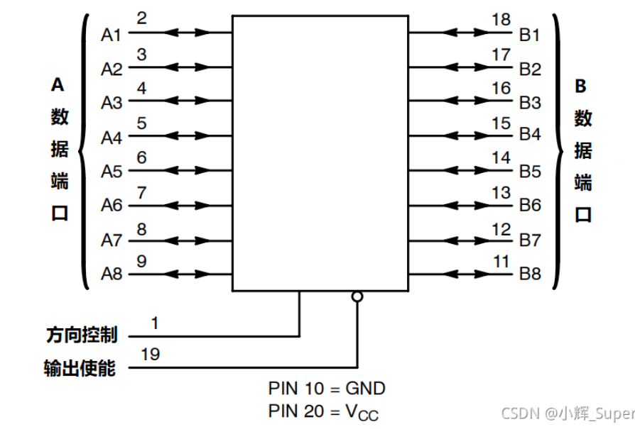

# 74HC245
典型的CMOS型三态缓冲门电路，八路信号收发器。
由于单片机或CPU的数据/地址/控制总线端口都有一定的负载能力，如果负载超过其负载能力，一般应加驱动器。
主要应用于大屏显示
# 引脚定义

$A_1$ ~ $A_8$ 数据输入/输出

$B_1$ ~ $B_8$ 数据输入/输出

$\overline{G}$($\overline{OE}$) 输出使能

DIR 方向控制
- DIR = 1 , A --> B
- DIR = 0 , B --> A
# 逻辑图

